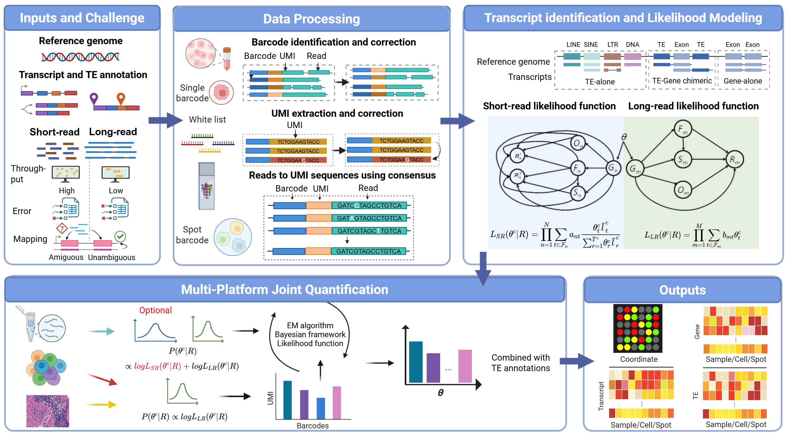

# LongReadQuant — Long-Read RNA Isoform Quantification

LongReadQuant is a long-read RNA-seq isoform quantification tool that supports bulk, single-cell (SC), and spatial transcriptomics (ST) analyses. It uses a community-based EM algorithm (expectation-maximization) to estimate isoform abundances from long-read alignments, with optional short-read integration. It also provides transposable element (TE) quantification at the bulk, per-cell, and per-spot level.

## Table of Contents

- [Features](#features)
- [Installation](#installation)
- [Data Preparation](#data-preparation)
- [Quick Start](#quick-start)
- [Subcommand: `quantify`](#subcommand-quantify)
- [Subcommand: `cal_TE`](#subcommand-cal_te)
- [Running Modes](#running-modes)
- [Output Files](#output-files)

---

## Features

- **Multi-mode support**: bulk, single-cell (10x Chromium), and spatial transcriptomics (Visium / Visium HD)
- **EM-based isoform quantification**: community-based parallel EM on gene-level bipartite graphs
- **UMI deduplication**: exact-match or Hamming-distance-based UMI collapsing for SC/ST modes
- **TE quantification**: annotates transcripts by TE overlap and computes TE expression at locus / subfamily / family / class level for bulk, per-cell, and per-spot data

---

## Installation

```bash
git clone https://github.com/calm109/LongReadQuant.git
cd LongReadQuant
conda env create -f environment.yml
conda activate LongReadQuant
```

### Additional dependencies for SC / ST modes

| Tool | Purpose | Install |
|------|---------|---------|
| [minimap2](https://github.com/lh3/minimap2) | Long-read genome alignment | `conda install -c bioconda minimap2` |
| [flexiplex](https://davidsongroup.github.io/flexiplex/) | Barcode discovery and demultiplexing | `conda install -c bioconda -c conda-forge flexiplex` |
| [nailpolish](https://github.com/DavidsonGroup/nailpolish) | UMI-based read deduplication and consensus | See below |

```bash
# nailpolish (Linux precompiled binary)
wget https://github.com/DavidsonGroup/nailpolish/releases/download/nightly_develop/nailpolish
chmod +x nailpolish
mkdir -p ~/bin && mv nailpolish ~/bin/
echo 'export PATH=~/bin:$PATH' >> ~/.bashrc && source ~/.bashrc
```

---

## Data Preparation

### Long-read alignment (all modes)

Use `minimap2` to align long reads to the **reference genome** in spliced mode. Build a `.mmi` index first to speed up repeated runs.

```bash
# Build genome index (do once)
minimap2 -d genome.mmi genome.fa

# ONT cDNA / direct RNA
minimap2 -y -ax splice --MD --secondary=no -G 200k -t 16 genome.mmi reads.fastq.gz > LR.sam

# PacBio HiFi / Iso-Seq
minimap2 --rev-only -y --secondary=no -ax splice:hq --MD -t 16 genome.mmi reads.fastq.gz \
    | samtools view -b | samtools sort -@ 8 -t CB -O SAM -o LR.sam
```

> **Note:** The `-y` flag propagates read tags (CB, UB) from the FASTQ header into the SAM output — required for SC/ST modes when barcodes are embedded in the read name.

### SC / ST preprocessing: barcode demultiplexing and UMI deduplication

Before alignment, extract and filter barcodes with flexiplex, then deduplicate UMIs with nailpolish.

```bash
# 1. Barcode discovery (generate whitelist)
gunzip -c reads.fastq.gz | flexiplex -d 10x3v3 -f 0 -p 16 > flexiplex.out
flexiplex-filter flexiplex_barcodes_counts.txt > flexiplex_barcodes_final.txt

# 2. Demultiplexing against the whitelist
# If you already have a barcode whitelist (e.g. a spatial barcode whitelist), skip step 1 (Barcode discovery),
# replace flexiplex_barcodes_final.txt with your own whitelist file,
# and run step 2 (Demultiplexing against the whitelist) directly.
gunzip -c reads.fastq.gz | flexiplex -d 10x3v3 -p 16 -k flexiplex_barcodes_final.txt > demux.fastq

# 3. UMI deduplication and consensus generation
nailpolish index --skip-unmatched demux.fastq
nailpolish summary demux.fastq
nailpolish consensus -t 16 demux.fastq > dedup.fastq
```

> For ST (Visium), a spatial barcode whitelist is typically available from Space Ranger output. Pass it directly to flexiplex with `-k` instead of the auto-discovered whitelist.

---

## Quick Start

### Bulk mode

```bash
python isoform_quantification/main.py quantify \
    -gtf annotation.gtf \
    -lrsam LR.sam \
    --bulk_mode \
    -t 16 \
    -o output/bulk
```

### Single-cell mode

```bash
# Step 1–3: demux → dedup → align (see Data Preparation)

# Step 4: isoform quantification
python isoform_quantification/main.py quantify \
    -gtf annotation.gtf \
    -lrsam LR_dedup.sam \
    --sc_mode \
    --no_barcode_in_readname \
    --cb_tag CB --umi_tag UB \
    -t 16 \
    -o output/sc

# Step 5: TE quantification
python isoform_quantification/main.py cal_TE \
    -gtf annotation.gtf \
    -te_gtf TE_annotation.gtf \
    --sc_quant output/sc \
    -t 16 \
    -o output/sc/te
```

### Spatial transcriptomics mode

```bash
# Step 1–3: demux → dedup → align (see Data Preparation)

# Step 4: isoform quantification
python isoform_quantification/main.py quantify \
    -gtf annotation.gtf \
    -lrsam LR_dedup.sam \
    --st_mode \
    --no_barcode_in_readname \
    --barcode_whitelist tissue_barcodes.txt \
    --tissue_positions tissue_positions.csv \
    -t 16 \
    -o output/st

# Step 5: TE quantification
python isoform_quantification/main.py cal_TE \
    -gtf annotation.gtf \
    -te_gtf TE_annotation.gtf \
    --st_quant output/st \
    -t 16 \
    -o output/st/te
```

---

## Subcommand: `quantify`

```
python main.py quantify -gtf <GTF> -o <OUTPUT> [options]
```

### Required arguments

| Argument | Description |
|---|---|
| `-gtf` / `--gtf_annotation_path` | Path to transcript GTF annotation file |
| `-o` / `--output_path` | Output directory |

### Input data (required)

| Argument | Description |
|---|---|
| `-lrsam` / `--long_read_sam_path` | Path to long-read SAM file (genome-aligned) |

### General optional arguments

| Argument | Default | Description |
|---|---|---|
| `-t` / `--threads` | `1` | Number of parallel worker processes |
| `--EM_SR_num_iters` | `200` | Maximum EM iterations |
| `--isoform_start_end_site_tolerance` | `20` | Tolerance (bp) for matching LR read start/end to isoform boundaries |
| `--junction_site_tolerance` | `5` | Tolerance (bp) for matching splice junction sites |
| `--multi_mapping_filtering` | `best` | Multi-mapping filtering strategy: `best` (keep best-scoring alignment) or `unique_only` |

### Mode flags (mutually exclusive)

| Flag | Description |
|---|---|
| `--bulk_mode` | Standard bulk transcript quantification |
| `--sc_mode` | Single-cell mode: extracts CB/UMI per read and outputs a cell × isoform count matrix |
| `--st_mode` | Spatial transcriptomics mode: extracts spot barcodes and outputs a spot × isoform count matrix |

### Single-cell mode arguments

| Argument | Default | Description |
|---|---|---|
| `--barcode_in_readname` | `True` | Barcode/UMI is embedded in the read name (flexiplex output) |
| `--no_barcode_in_readname` | — | Read barcode from SAM tags instead of the read name |
| `--cb_tag` | `CB` | SAM tag for cell barcode (used with `--no_barcode_in_readname`) |
| `--umi_tag` | `UB` | SAM tag for UMI (used with `--no_barcode_in_readname`) |
| `--barcode_separator` | `_` | Separator between read name / barcode / UMI in the read name |
| `--umi_dedup_hamming` | `0` | Hamming distance threshold for UMI deduplication (0 = exact match, 1 = 1-mismatch allowed) |

### Spatial transcriptomics mode arguments

| Argument | Default | Description |
|---|---|---|
| `--barcode_whitelist` | `None` | Path to spatial barcode whitelist file (one barcode per line); barcodes not in the list are discarded |
| `--tissue_positions` | `None` | Path to `tissue_positions.csv` (Visium format); appends spatial coordinates to output |

---

## Subcommand: `cal_TE`

Annotates each transcript by overlap with transposable elements and computes TE expression at locus / subfamily / family / class level for bulk, per-cell, and/or per-spot data.

```
python main.py cal_TE -gtf <GTF> -te_gtf <TE_GTF> -o <OUTPUT> [options]
```

### Required arguments

| Argument | Description |
|---|---|
| `-gtf` / `--gtf_annotation_path` | Path to transcript GTF annotation file |
| `-te_gtf` / `--te_gtf_path` | Path to TE GTF annotation file |
| `-o` / `--output_path` | Output directory |

### TE annotation thresholds

| Argument | Default | Description |
|---|---|---|
| `--first_exon_threshold` | `50.0` | First-exon TE proportion (%) threshold for TE-derived transcript detection |
| `--total_threshold` | `50.0` | Full-transcript TE proportion (%) threshold |
| `--te_overlap_threshold` | `10` | Minimum TE overlap length (bp) to distinguish gene-only from TE-containing transcripts |
| `--te_ratio_threshold` | `80.0` | TE proportion (%) in full transcript for TE-alone identification |
| `--te_feature_threshold` | `50` | TE overlap length (bp) within TSS/TES 200 bp window for sub-classification |

### Quantification inputs (at least one optional)

| Argument | Description |
|---|---|
| `--bulk_quant` | Path to a bulk quantification TSV (e.g. `Isoform_abundance.out`, or any tool's output with a transcript-ID column and a TPM column — column names are auto-detected, so Salmon/kallisto/IsoQuant output works too); triggers bulk TE expression computation |
| `--sc_quant` | Path to the quantification output directory from a prior LongReadQuant `quantify --sc_mode` run; triggers per-cell TE metrics, written to `<sc_quant>/SC_output/TE/` |
| `--st_quant` | Path to the quantification output directory from a prior LongReadQuant `quantify --st_mode` run; triggers per-spot TE metrics, written to `<st_quant>/ST_output/TE/` |
| `--custom_sc_quant` | Path to a per-cell isoform quantification directory produced by **any** tool (not necessarily LongReadQuant); triggers per-cell TE metrics, written to `<output_path>/Custom_SC_TE_output/` |
| `--custom_st_quant` | Path to a per-spot isoform quantification directory produced by **any** tool; triggers per-spot TE metrics, written to `<output_path>/Custom_ST_TE_output/` |
| `--percent_threshold` | Minimum TE-overlap proportion (overlap / TE_length) to associate a transcript with a TE [default: `0.5`] |

`--sc_quant` / `--st_quant` / `--custom_sc_quant` / `--custom_st_quant` all expect the same
directory layout: a standard 10x MEX triplet (`barcodes.tsv`, `features.tsv`, `matrix.mtx`),
found either directly in the given directory or under an `isoform/`, `SC_output/isoform/` or
`ST_output/isoform/` subdirectory. Each of the three MEX files may be plain text **or
gzip-compressed** (e.g. `barcodes.tsv.gz` — the default CellRanger layout); both are detected
automatically. Isoform IDs in `features.tsv` must match the `transcript_id` values produced
from `-gtf`. Matching tries an exact string match first, then falls back to comparing IDs with
any trailing Ensembl-style version suffix stripped (so `ENST00000448958` matches
`ENST00000448958.2`) — a version-only mismatch between `-gtf` and the quantification result is
therefore tolerated automatically. A low ID match rate is reported as a warning at runtime; if
it persists after the version-stripped fallback, it usually means `-gtf` does not match the
annotation used to produce the quantification result at all (e.g. novel transcripts from an
external tool's discovery mode, or a different transcript ID namespace such as RefSeq vs.
GENCODE).

Use `--custom_sc_quant` / `--custom_st_quant` instead of `--sc_quant` / `--st_quant` when the
isoform-level quantification was produced by a different tool — the TE aggregation logic is
identical, only the input provenance and output location differ (results are written under
`-o` instead of inside the input directory, so a read-only or third-party directory is never
written to).

**Example: TE quantification from another tool's per-cell results**

```bash
python main.py cal_TE \
    -gtf annotation.gtf \
    -te_gtf TE_annotation.gtf \
    --custom_sc_quant /path/to/other_tool/per_cell_isoform_mex_dir \
    -t 16 \
    -o output/te
```

Results are written to `output/te/Custom_SC_TE_output/`. `/path/to/other_tool/per_cell_isoform_mex_dir`
must contain `barcodes.tsv`/`features.tsv`/`matrix.mtx` (plain or `.gz`), with isoform IDs matching
`annotation.gtf`.

---

## Running Modes

### Bulk mode

Standard transcript-level quantification. Each long read is probabilistically assigned to isoforms using the EM algorithm. No barcode/UMI processing.

- Input: genome-aligned long-read SAM (`-lrsam`)
- Output: `Isoform_abundance.out` (CPM + expected read counts per isoform)

### Single-cell mode

Reads carry cell barcode (CB) and UMI (UB) tags. After genome alignment:
1. Reads are grouped by gene community
2. Per-cell EM estimates isoform proportions within each cell independently
3. UMI deduplication collapses reads sharing the same CB + UMI
4. Outputs sparse MEX matrices (isoform-level and gene-level)

Barcode source (choose one):
- Flexiplex output: barcodes embedded in read name → use `--barcode_in_readname` (default)
- SAM tags (CB/UB): e.g. from STARsolo → use `--no_barcode_in_readname --cb_tag CB --umi_tag UB`

### Spatial transcriptomics mode

Identical to single-cell mode but uses spot barcodes. Additional options:
- `--barcode_whitelist`: restrict to tissue-covered spots
- `--tissue_positions`: attach spatial coordinates (array_row, array_col, pixel coordinates) to output

---

## Output Files

### `quantify --bulk_mode`

| File | Description |
|---|---|
| `Isoform_abundance.out` | Main result: isoform CPM and estimated LR read counts per isoform |
| `LR_EM_expression.out` | Per-isoform CPM and EM theta per gene community |
| `EM_iterations.tsv` | EM convergence trace (theta per isoform per iteration) |

**`Isoform_abundance.out` columns**:

| Column | Description |
|---|---|
| `Isoform` | Isoform transcript ID |
| `Gene` | Gene ID |
| `num_expected_LRs` | Estimated LR read count |
| `CPM` | Counts per million (not length-normalized; each LR read represents one complete transcript molecule) |

> CPM is used instead of TPM for long-read data because LR reads are full-length — transcript length does not introduce sequencing bias.

---

### `quantify --sc_mode` → `SC_output/`

```
SC_output/
├── isoform/
│   ├── barcodes.tsv         one cell barcode per line
│   ├── features.tsv         isoform_id  gene_id  Gene Expression
│   ├── matrix.mtx           sparse UMI count matrix  (isoforms × cells)
│   └── cpm_matrix.mtx       sparse CPM matrix        (isoforms × cells)
└── gene/
    ├── barcodes.tsv
    ├── features.tsv          gene_id  gene_id  Gene Expression
    ├── matrix.mtx            gene-level UMI count matrix (genes × cells)
    └── cpm_matrix.mtx        gene-level CPM matrix
```

All files use the standard MEX (Market Exchange Format), directly compatible with `Seurat::ReadMtx()` and `scanpy.read_mtx()`.

**CPM definition (per cell)**:

```
CPM_i = count_i / total_cell_UMIs × 10^6
```

CPM is used (not TPM) because UMI counts are not length-biased — each UMI represents one captured transcript molecule regardless of length.

---

### `quantify --st_mode` → `ST_output/`

Same structure as `SC_output/` but under `ST_output/`. Spot barcodes replace cell barcodes.

If `--tissue_positions` is provided, spatial coordinates are appended to the output for direct import into Squidpy / SpatialDE.

---

### `cal_TE` output

| Output | Condition | Description |
|---|---|---|
| `transcript_quantification_with_TE.tsv` | always | Per-transcript TE overlap annotation table (every transcript in `-gtf`) |
| `TE_derived_transcripts.tsv` | any transcripts meet the TE-derived thresholds | Subset of transcripts classified as TE-derived, with dominant TE info |
| `transcript_quantification_with_TE_TPM.tsv` | `--bulk_quant` provided | Same per-transcript table with real `transcript_TPM` values merged in |
| `Bulk_TE_output/` | `--bulk_quant` provided | `TE_loci_exp_TPM.tsv`, `TE_subfamily_exp_TPM.tsv`, `TE_family_exp_TPM.tsv`, `TE_class_exp_TPM.tsv` — TE expression at locus / subfamily / family / class level |
| `<sc_quant>/SC_output/TE/` | `--sc_quant` provided | Per-cell TE count tables, written **inside** the input quantification directory |
| `<st_quant>/ST_output/TE/` | `--st_quant` provided | Per-spot TE count tables, written **inside** the input quantification directory |
| `<output_path>/Custom_SC_TE_output/` | `--custom_sc_quant` provided | Per-cell TE count tables, for quantification results from any tool, written under `-o` |
| `<output_path>/Custom_ST_TE_output/` | `--custom_st_quant` provided | Per-spot TE count tables, for quantification results from any tool, written under `-o` |

**Per-cell / per-spot TE output files** (inside `SC_output/TE/`, `ST_output/TE/`,
`Custom_SC_TE_output/` or `Custom_ST_TE_output/` — `cell_*` for SC, `spot_*` for ST):

| File | Description |
|---|---|
| `{cell,spot}_transcript_classification_counts.tsv` | Per-cell/spot count breakdown by transcript classification (Gene-alone / TE-Gene / TE-alone / ...) |
| `{cell,spot}_te_class_counts.tsv` | Per-cell/spot counts aggregated to TE class level (LINE, SINE, LTR, ...) |
| `{cell,spot}_te_family_counts.tsv` | Per-cell/spot counts aggregated to TE family level |
| `{cell,spot}_te_subfamily_counts.tsv` | Per-cell/spot counts aggregated to TE subfamily level |
| `{cell,spot}_te_loci_counts.tsv` (or `*_matrix.mtx` MEX triplet if very wide) | Per-cell/spot counts aggregated to individual TE locus — only with `--output_loci` |
| `README.txt` | Description of the files in this directory |

**TE annotation columns** (in `transcript_quantification_with_TE.tsv`):

| Column | Description |
|---|---|
| `transcript_id` | Transcript ID |
| `gene_id` | Gene ID |
| `transcript_TPM` | Transcript expression (TPM); `0` unless merged from `--bulk_quant` |
| `transcript_length` | Transcript length (bp) |
| `num_TEs` | Number of distinct TE elements overlapping this transcript |
| `transcript_classification` | TE classification: `Gene-alone`, `TE-alone`, `TE-Gene`, `Gene-TE`, `TE-Gene-TE` |
| `transcript_sub_classification` | Finer-grained sub-classification (comma-separated if multiple) |
| `first_exon_TE_proportion` | TE proportion in the first exon (%) |
| `total_transcript_TE_proportion` | TE proportion across the full transcript (%) |
| `tss_200_overlap` / `tes_200_overlap` | TE overlap length (bp) within the 200 bp TSS / TES window |
| `locus` / `subfamily` / `family` / `class` | Semicolon-separated TE locus / subfamily / family / class for each overlapping TE |
| `length` / `overlap_length` | Semicolon-separated TE length / overlap length (bp) for each overlapping TE |

---

## Full Pipeline Examples

### Bulk pipeline (SLURM)

```bash
#!/bin/bash
#SBATCH --cpus-per-task=16 --mem=64G

source ~/miniforge3/etc/profile.d/conda.sh
conda activate LongReadQuant

GTF="/path/to/annotation.gtf"
TE_GTF="/path/to/TE_annotation.gtf"
OUT_DIR="output/bulk"

# Step 1: isoform quantification
python isoform_quantification/main.py quantify \
    -gtf "$GTF" \
    -lrsam /path/to/LR.sam \
    --bulk_mode \
    -t 16 \
    -o "$OUT_DIR"

# Step 2: TE quantification
python isoform_quantification/main.py cal_TE \
    -gtf "$GTF" \
    -te_gtf "$TE_GTF" \
    --bulk_quant "$OUT_DIR/Isoform_abundance.out" \
    -t 16 \
    -o "$OUT_DIR/te"
```

### Single-cell pipeline (ONT, 10x 3' v3)

```bash
#!/bin/bash
SAMPLE="sample_name"
RAW_FQ="${SAMPLE}.fastq.gz"
REF="genome.fa"; INDEX="genome.mmi"; GTF="annotation.gtf"; TE_GTF="TE_annotation.gtf"
THREADS=16; OUT_DIR="output/sc"

# Step 1: barcode discovery & demultiplexing
gunzip -c "$RAW_FQ" | flexiplex -d 10x3v3 -f 0 -p $THREADS > flexiplex.out
flexiplex-filter flexiplex_barcodes_counts.txt > barcodes_whitelist.txt
gunzip -c "$RAW_FQ" | flexiplex -d 10x3v3 -p $THREADS -k barcodes_whitelist.txt > demux.fastq

# Step 2: UMI deduplication
nailpolish index --skip-unmatched demux.fastq
nailpolish summary demux.fastq
nailpolish consensus -t $THREADS demux.fastq > dedup.fastq && rm demux.fastq

# Step 3: alignment
[ ! -f "$INDEX" ] && minimap2 -d "$INDEX" "$REF"
minimap2 -y -ax splice --MD --secondary=no -G 200k -t $THREADS "$INDEX" dedup.fastq > LR.sam

# Step 4: isoform quantification
python isoform_quantification/main.py quantify \
    -gtf "$GTF" -lrsam LR.sam \
    --sc_mode --no_barcode_in_readname --cb_tag CB --umi_tag UB \
    -t $THREADS -o "$OUT_DIR"

# Step 5: TE quantification
python isoform_quantification/main.py cal_TE \
    -gtf "$GTF" -te_gtf "$TE_GTF" \
    --sc_quant "$OUT_DIR" \
    -t 16 \
    -o "$OUT_DIR/te"
```

### Spatial transcriptomics pipeline (Visium, ONT)

```bash
#!/bin/bash
SAMPLE="sample_name"
REF="genome.fa"; INDEX="genome.mmi"; GTF="annotation.gtf"; TE_GTF="TE_annotation.gtf"
THREADS=16; OUT_DIR="output/st"

# Steps 1–3: same as single-cell (use Visium barcode whitelist for flexiplex)

# Step 4: isoform quantification
python isoform_quantification/main.py quantify \
    -gtf "$GTF" -lrsam LR.sam \
    --st_mode --no_barcode_in_readname \
    --barcode_whitelist tissue_barcodes.txt \
    --tissue_positions tissue_positions.csv \
    -t $THREADS -o "$OUT_DIR"

# Step 5: TE quantification
python isoform_quantification/main.py cal_TE \
    -gtf "$GTF" -te_gtf "$TE_GTF" \
    --st_quant "$OUT_DIR" \
    -t 16 \
    -o "$OUT_DIR/te"
```
